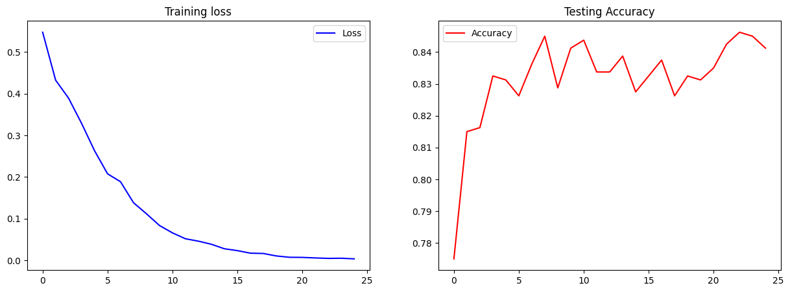

# Fine-tuning Xception model with VN-Celeb dataset

## Requiments
Run the code in Colab Google platform is the easiest way.
To run in local, you must installed these libraries.
```
os
random
numpy
seaborn
tesorflow
matplotlib
sklearn
```

## Dataset and model

The fine-tuning model was written by Python in TensorFlow. The model was trained on the Google Colab platform and used the Triplet loss function.

VN-Celeb is a dataset consists of 23,105 faces of over 1,000 Vietnamese individuals. All images have been cropped to extract the facial region and has 128x128 pixels RGB. Currently, the dataset has been fully publicly released for educational and research purposes [here](https://drive.google.com/drive/folders/1I3KXcGpmm6zpw_y07p-7wIKt5K08iOgc).

After the training process, the model obtained evaluation results as follows:



The checkpoint model after 25 epochs has been released in [here](https://drive.google.com/drive/folders/1Gpcth0OSgYP84T9KUe4ebWWBrb7SIJ-R?usp=sharing).

You can read more infor about this project in the report.
